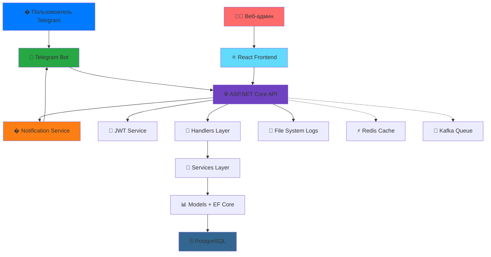

    # 🔔 Emergency Notification System - Система экстренных оповещений МЧС


**Прототип системы безопасности МЧС в Telegram** - современная платформа для массовых уведомлений и управления чрезвычайными ситуациями через популярный мессенджер.

---

## 📖 Оглавление

- [🎯 О проекте](#-о-проекте)
- [✨ Ключевые возможности](#-ключевые-возможности)
- [🏗️ Архитектура системы](#️-архитектура-системы)
- [🛠️ Технологический стек](#️-технологический-стек)
- [🚀 Быстрый старт](#-быстрый-старт)
- [📋 Использование](#-использование)
- [🔮 Дорожная карта](#-дорожная-карта)
- [💼 Бизнес-применение](#-бизнес-применение)
- [🤝 Разработка](#-разработка)

---

## 🎯 О проекте

**Emergency Notification System** - это инновационная платформа для экстренного оповещения населения, построенная на базе Telegram. Система позволяет МЧС и другим экстренным службам мгновенно доставлять критически важную информацию целевым аудиториям.

### 🔥 Проблема
- Медленное доведение информации до населения при ЧС
- Отсутствие персонализированных уведомлений по регионам
- Сложности управления массовыми рассылками
- Необходимость быстрого развертывания системы оповещения

### 💡 Решение
- Мгновенные уведомления через Telegram
- Географическая таргетизация сообщений
- Простое управление через консоль (с переходом на Telegram-интерфейс)
- Масштабируемая архитектура для обработки тысяч сообщений

---

## ✨ Ключевые возможности

### 🎯 Реализованный функционал

#### Backend (ASP.NET Core API)
- **🌐 RESTful API** - полноценный Web API с документацией Swagger
- **🔐 JWT аутентификация** - безопасная система входа с токенами
- **👥 Управление пользователями** - CRUD операции через API endpoints
- **🏙️ Гео-рассылки** - отправка сообщений по городам и регионам через API
- **👤 Персональные уведомления** - точечная коммуникация с пользователями
- **📊 Статистика регионов** - аналитика по распределению пользователей
- **📁 Система логов** - индивидуальные файлы истории для каждого пользователя
- **🗄️ PostgreSQL + EF Core** - надежное хранение данных с миграциями
- **🐳 Docker поддержка** - контейнеризация для легкого развертывания
- **🔄 CORS настройка** - безопасное взаимодействие Frontend-Backend

#### Frontend (React)
- **⚛️ React SPA** - современный одностраничный интерфейс
- **🎨 Интуитивный UI** - удобная навигация между разделами
- **👥 Управление пользователями** - просмотр и фильтрация пользователей
- **🗺️ Просмотр регионов** - статистика по городам с визуализацией
- **📤 Отправка уведомлений** - интерфейс для массовых и личных рассылок
- **📋 Просмотр логов** - система и пользовательские логи в реальном времени
- **🔌 API интеграция** - централизованная работа с Backend через handlers

#### Telegram Bot
- **🤖 Автоматическая регистрация** - простой процесс через /start команду
- **📝 Сбор данных** - имя, возраст, город пользователя
- **💾 Интеграция с БД** - автоматическое сохранение в PostgreSQL
- **📨 Получение уведомлений** - мгновенная доставка сообщений от МЧС
- **📊 Логирование** - история всех взаимодействий с ботом

#### Архитектура
- **🏗️ Слоистая архитектура** - Controllers → Handlers → Services → Models
- **📦 DTO паттерн** - безопасная передача данных между слоями
- **🔍 Поиск в БД** - оптимизированные запросы через SearchingInBD
- **📧 Notification Service** - централизованная отправка уведомлений
- **🔐 JwtService** - генерация и валидация токенов
- **📝 FileSystem логирование** - структурированное хранение логов

### 🚀 В активной разработке
- **🌐 Веб-форма входа** - страница аутентификации для Frontend
- **🔒 Защита endpoints** - использование [Authorize] атрибутов
- **👮 Ролевая система** - разграничение прав admin/moderator/user
- **⚡ Redis кеширование** - ускорение частых запросов
- **🔁 Kafka очереди** - асинхронная обработка массовых рассылок
- **📱 Telegram админ-панель** - управление через бота для операторов
- **📈 Расширенная аналитика** - дашборды и отчеты

---

## 🏗️ Архитектура системы

### Общая схема



### Слоистая архитектура Backend

```
┌─────────────────────────────────────────────────────────────┐
│                    Controllers Layer                         │
│  • HTTP Endpoints (GET, POST, PUT, DELETE)                   │
│  • Обработка ошибок (try/catch)                              │
│  • Возврат статусов (Ok, BadRequest, NotFound)               │
│  • JWT авторизация ([Authorize])                             │
└────────────────────────┬────────────────────────────────────┘
                         ↓
┌─────────────────────────────────────────────────────────────┐
│                     Handlers Layer                           │
│  • Бизнес-логика приложения                                  │
│  • Валидация данных                                          │
│  • Координация между сервисами                               │
└────────────────────────┬────────────────────────────────────┘
                         ↓
┌─────────────────────────────────────────────────────────────┐
│                     Services Layer                           │
│  • JwtService - генерация токенов                            │
│  • NotificationService - отправка уведомлений                │
│  • SearchingInBD - поиск в базе данных                       │
└────────────────────────┬────────────────────────────────────┘
                         ↓
┌─────────────────────────────────────────────────────────────┐
│                   Models + EF Core                           │
│  • User - модель пользователя                                │
│  • BaseContext - DbContext для PostgreSQL                    │
│  • Миграции базы данных                                      │
└────────────────────────┬────────────────────────────────────┘
                         ↓
┌─────────────────────────────────────────────────────────────┐
│                      PostgreSQL                              │
│  • Таблица users                                             │
│  • Хранение истории миграций                                 │
└─────────────────────────────────────────────────────────────┘
```

### Поток данных при отправке уведомления

```
Веб-админ → React → POST /api/notifications/city
                         ↓
              NotificationsController
                         ↓
              NotificationsHandler
                         ↓
         SearchingInBD.SearchByCity() → PostgreSQL
                         ↓
              NotificationService
                         ↓
                  Telegram Bot API
                         ↓
              👥 Пользователи получают сообщения
```


---

## 🛠️ Технологический стек

### Backend
- **Framework:** ASP.NET Core 9.0
- **Language:** C# 12
- **ORM:** Entity Framework Core 9.0
- **Database:** PostgreSQL 15.0
- **Authentication:** JWT (JSON Web Tokens)
- **API Documentation:** Swagger/OpenAPI
- **Containerization:** Docker & Docker Compose
- **Logging:** Custom File System Logger

### Frontend
- **Framework:** React 18
- **Language:** JavaScript (ES6+)
- **HTTP Client:** Fetch API
- **Styling:** CSS3
- **Build Tool:** Create React App

### Telegram Integration
- **Library:** Telegram.Bot (C#)
- **API:** Telegram Bot API
- **Polling:** Long Polling для получения обновлений

### DevOps & Tools
- **Version Control:** Git
- **Container Platform:** Docker
- **Database Migration:** EF Core Migrations
- **Environment Variables:** .env файлы

---

## 🚀 Быстрый старт

### Предварительные требования
- .NET SDK 9.0 или выше
- Node.js 16+ и npm
- PostgreSQL 15+ (или Docker)
- Telegram Bot Token (получить у [@BotFather](https://t.me/botfather))

### 1. Клонирование репозитория
```bash
git clone https://github.com/your-repo/NotifySys.git
cd NotifySys
```

### 2. Настройка Backend

#### Вариант A: Через Docker (рекомендуется)
```bash
cd API
docker-compose up -d
```

#### Вариант B: Локально
```bash
cd API

# Создайте .env файл с настройками
cat > .env << EOF
PATH_TO_DB=Host=localhost;Database=notifysys;Username=postgres;Password=yourpassword
TELEGRAM_BOT_TOKEN=your-telegram-bot-token-from-botfather
Jwt__Key=your-super-secret-key-minimum-32-characters-long
Jwt__Issuer=NotifySysAPI
Jwt__Audience=NotifySysAPI
Jwt__ExpirationInMinutes=60
EOF

# Запуск API
dotnet run
```

API будет доступен на: **http://localhost:8080**  
Swagger UI: **http://localhost:8080/swagger**

### 3. Настройка Frontend
```bash
cd FRONT

# Установка зависимостей
npm install

# Запуск dev сервера
npm start
```

Frontend будет доступен на: **http://localhost:3000**

### 4. Настройка Telegram бота
1. Создайте бота через [@BotFather](https://t.me/botfather)
2. Получите токен
3. Добавьте токен в `.env` файл Backend
4. Перезапустите Backend
5. Найдите вашего бота в Telegram и отправьте `/start`

---

## 📋 Использование

### Регистрация пользователя через Telegram
1. Найдите вашего бота в Telegram
2. Отправьте команду `/start`
3. Введите возраст
4. Введите город
5. Готово! Вы зарегистрированы в системе

### Вход в веб-интерфейс
1. Откройте http://localhost:3000
2. Введите имя пользователя (из Telegram) или Chat ID
3. Введите пароль (если установлен)
4. Нажмите "Войти"

### Отправка уведомлений

#### Через веб-интерфейс:
1. Войдите в систему
2. Выберите "Отправить предупреждение"
3. Выберите тип рассылки:
   - **По городу** - всем пользователям города
   - **Персональная** - конкретному пользователю
4. Введите текст сообщения
5. Нажмите "Отправить"

#### Через API:
```bash
# Отправка сообщения в город
curl -X POST http://localhost:8080/api/notifications/city \
  -H "Content-Type: application/json" \
  -H "Authorization: Bearer YOUR_JWT_TOKEN" \
  -d '{
    "city": "Москва",
    "message": "⚠️ Внимание! Сильный ветер!"
  }'

# Отправка личного сообщения
curl -X POST http://localhost:8080/api/notifications/user \
  -H "Content-Type: application/json" \
  -H "Authorization: Bearer YOUR_JWT_TOKEN" \
  -d '{
    "userId": 1,
    "message": "Персональное уведомление"
  }'
```

### Просмотр логов
1. В веб-интерфейсе выберите "Логи"
2. Выберите тип логов:
   - **Системные** - все события системы
   - **Пользовательские** - история конкретного пользователя
3. Просмотрите историю действий

---

## 📚 API Документация

### Основные endpoints

#### Authentication
- `POST /api/auth/login` - Вход в систему
- `POST /api/auth/register` - Регистрация нового пользователя

#### Users
- `GET /api/users` - Получить всех пользователей
- `GET /api/users/{id}` - Получить пользователя по ID
- `GET /api/users/city/{city}` - Получить пользователей города
- `POST /api/users` - Создать пользователя

#### Regions
- `GET /api/regions/statistics` - Статистика по городам

#### Notifications
- `POST /api/notifications/user` - Отправить сообщение пользователю
- `POST /api/notifications/city` - Отправить сообщение в город

#### Logs
- `GET /api/logs/system` - Получить системные логи
- `GET /api/logs/users` - Получить список пользовательских логов
- `GET /api/logs/users/{fileName}` - Получить лог конкретного пользователя

Полная документация доступна в Swagger UI: **http://localhost:8080/swagger**

---

## 🔮 Дорожная карта

### Версия 1.1 (В разработке)
- [ ] Веб-форма входа с JWT аутентификацией
- [ ] Защита API endpoints через [Authorize]
- [ ] Ролевая система (admin, moderator, user)
- [ ] Расширенная валидация данных

### Версия 1.2 (Планируется)
- [ ] Redis кеширование для ускорения запросов
- [ ] Kafka для асинхронной обработки массовых рассылок
- [ ] Telegram админ-панель для операторов
- [ ] Расширенная аналитика и дашборды

### Версия 2.0 (Будущее)
- [ ] Поддержка мультиязычности
- [ ] Геолокация пользователей
- [ ] Push-уведомления для веб-интерфейса
- [ ] Мобильное приложение (iOS/Android)
- [ ] Интеграция с другими мессенджерами (WhatsApp, Viber)
- [ ] Машинное обучение для предсказания ЧС

---

## 💼 Бизнес-применение

### Целевая аудитория
- **МЧС и экстренные службы** - оповещение населения о ЧС
- **Муниципальные власти** - информирование жителей
- **Образовательные учреждения** - уведомления студентов и родителей
- **Корпорации** - внутренние коммуникации с сотрудниками
- **ТСЖ и управляющие компании** - оповещение жильцов

### Преимущества
- ✅ **Быстрое развертывание** - готово к использованию за 10 минут
- ✅ **Масштабируемость** - от сотен до миллионов пользователей
- ✅ **Низкая стоимость** - использует бесплатный Telegram API
- ✅ **Высокая доставляемость** - 99%+ пользователей получают сообщения
- ✅ **Географическая таргетизация** - точечные рассылки по регионам
- ✅ **Открытый исходный код** - полная кастомизация под ваши нужды

### Кейсы использования
1. **Экстренное оповещение** - пожары, наводнения, землетрясения
2. **Плановые работы** - отключение воды, электричества
3. **Общественные мероприятия** - концерты, митинги, праздники
4. **Образование** - расписание, отмена занятий, важные объявления
5. **Бизнес** - корпоративные новости, срочные уведомления

---

## 🤝 Разработка

### Структура проекта
```
NotifySys/
├── API/                          # Backend (ASP.NET Core)
│   ├── Controllers/              # HTTP endpoints
│   ├── Handlers/                 # Бизнес-логика
│   ├── Services/                 # Сервисы (JWT, Notifications)
│   ├── Models/                   # Модели данных (User, BaseContext)
│   ├── DTO/                      # Data Transfer Objects
│   ├── SearchingInBD/            # Функции поиска в БД
│   ├── MailManager/              # Отправка уведомлений
│   ├── FileSys/                  # Файловая система и логи
│   ├── Migrations/               # EF Core миграции
│   ├── Program.cs                # Точка входа
│   ├── TelegramBot.cs            # Telegram бот
│   └── docker-compose.yml        # Docker конфигурация
│
├── FRONT/                        # Frontend (React)
│   ├── src/
│   │   ├── components/           # React компоненты
│   │   │   ├── MainMenu.js
│   │   │   ├── UsersMenu.js
│   │   │   ├── RegionsMenu.js
│   │   │   ├── SendWarningMenu.js
│   │   │   └── LogsMenu.js
│   │   ├── handlers/
│   │   │   └── api.js            # HTTP запросы к API
│   │   ├── App.js                # Главный компонент
│   │   └── index.js              # Точка входа
│   └── package.json
│
├── unit_tests/                   # Юнит-тесты
│   ├── FileSystemTests.cs
│   ├── BDTests.cs
│   └── NotificationServiceTests.cs
│
└── README.MD                     # Этот файл
```

### Запуск тестов
```bash
cd unit_tests
dotnet test
```

### Создание миграции
```bash
cd API
dotnet ef migrations add MigrationName
dotnet ef database update
```

### Сборка для production
```bash
# Backend
cd API
dotnet publish -c Release

# Frontend
cd FRONT
npm run build
```

---

## 📄 Лицензия

Этот проект создан в образовательных целях.

---

## 👥 Авторы

Разработано студентами для курсового проекта.

---

## 📞 Контакты

Если у вас есть вопросы или предложения, создайте Issue в репозитории.

---

## 🙏 Благодарности

- Telegram за отличный Bot API
- ASP.NET Core команде за мощный фреймворк
- React команде за удобную библиотеку
- PostgreSQL за надежную СУБД
- Всем контрибьюторам open-source проектов

---

**⭐ Если проект был полезен, поставьте звезду на GitHub!**
