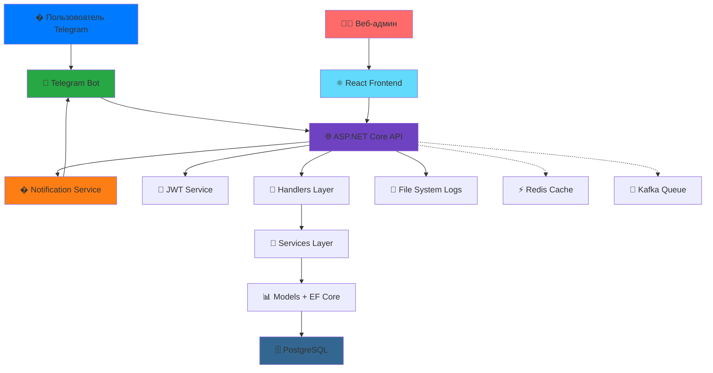

    # 🔔 Emergency Notification System - Система экстренных оповещений МЧС

**Прототип системы безопасности МЧС в Telegram** - современная платформа для массовых уведомлений и управления чрезвычайными ситуациями через популярный мессенджер.

---

## 📖 Оглавление

- [🎯 О проекте](#-о-проекте)
- [✨ Ключевые возможности](#-ключевые-возможности)
- [🏗️ Архитектура системы](#️-архитектура-системы)
- [🛠️ Технологический стек](#️-технологический-стек)
- [🚀 Быстрый старт](#-быстрый-старт)
- [📋 Использование](#-использование)
- [🔮 Дорожная карта](#-дорожная-карта)
- [💼 Бизнес-применение](#-бизнес-применение)
- [🤝 Разработка](#-разработка)

---

## 🎯 О проекте

**Emergency Notification System** - это инновационная платформа для экстренного оповещения населения, построенная на базе Telegram. Система позволяет МЧС и другим экстренным службам мгновенно доставлять критически важную информацию целевым аудиториям.

### 🔥 Проблема
- Медленное доведение информации до населения при ЧС
- Отсутствие персонализированных уведомлений по регионам
- Сложности управления массовыми рассылками
- Необходимость быстрого развертывания системы оповещения

### 💡 Решение
- Мгновенные уведомления через Telegram
- Географическая таргетизация сообщений
- Простое управление через консоль (с переходом на Telegram-интерфейс)
- Масштабируемая архитектура для обработки тысяч сообщений

---

## ✨ Ключевые возможности

### 🎯 Реализованный функционал

#### Backend (ASP.NET Core API)
- **🌐 RESTful API** - Web API с документацией Swagger
- **🔐 JWT аутентификация** - система входа с токенами
- **👥 Управление пользователями** - CRUD операции через API 
- **🏙️ Гео-рассылки** - отправка сообщений по городам и регионам через API
- **👤 Персональные уведомления** - отправление уведомлений отдельным пользователям
- **📊 Статистика регионов** - аналитика по распределению пользователей
- **📁 Система логов** - индивидуальные файлы истории для каждого пользователя
- **🗄️ PostgreSQL + EF Core** - хранение данных с миграциями
- **🐳 Docker поддержка** - контейнеризация для дальнейшего развертывания на сервере
- **🔄 CORS настройка** - взаимодействие Frontend-Backend

#### Frontend (React)
- **⚛️ React** -  интерфейс
- **🎨 UI** - навигация между разделами

### 🚀 В активной разработке
- **🌐 Веб-форма входа** - страница аутентификации для Frontend
- **🔒 Защита endpoints** - использование [Authorize] атрибутов
- **👮 Ролевая система** - разграничение прав admin/moderator/user
- **⚡ Redis кеширование** - ускорение частых запросов
- **🔁 Kafka очереди** - асинхронная обработка массовых рассылок
- **📱 Telegram админ-панель** - управление через бота для операторов
- **📈 Расширенная аналитика** - дашборды и отчеты

---

## 🏗️ Архитектура системы

### Общая схема

## 🛠️ Технологический стек

### Backend
- **Framework:** ASP.NET Core 9.0
- **Language:** C# 
- **ORM:** Entity Framework Core 9.0
- **Database:** PostgreSQL 15.0
- **Authentication:** JWT (JSON Web Tokens)
- **API Documentation:** Swagger/OpenAPI
- **Containerization:** Docker & Docker Compose
- **Logging:** Custom File System Logger

### Frontend
- **Framework:** React 18
- **Language:** JavaScript (ES6+)
- **HTTP Client:** Fetch API
- **Styling:** CSS3
- **Build Tool:** Create React App

### Telegram Integration
- **Library:** Telegram.Bot (C#)
- **API:** Telegram Bot API
- **Polling:** Long Polling для получения обновлений

### DevOps & Tools
- **Version Control:** Git
- **Container Platform:** Docker
- **Database Migration:** EF Core Migrations
- **Environment Variables:** .env файлы

---

## 🔮 Дорожная карта

### Версия 2.1 (В разработке)
- [ ] Веб-форма входа с JWT аутентификацией
- [ ] Защита API endpoints через [Authorize]
- [ ] Ролевая система (admin, moderator, user)
- [ ] Расширенная валидация данных

### Версия 2.2 (Планируется)
- [ ] Redis кеширование для ускорения запросов
- [ ] Kafka для асинхронной обработки массовых рассылок
- [ ] Telegram админ-панель для операторов
- [ ] Расширенная аналитика и дашборды

### Версия 2.3 (Будущее)
- [ ] Поддержка мультиязычности
- [ ] Геолокация пользователей
- [ ] Push-уведомления для веб-интерфейса
- [ ] Мобильное приложение (iOS/Android)
- [ ] Интеграция с другими мессенджерами (WhatsApp, Viber)
- [ ] Машинное обучение для предсказания ЧС

---

## 💼 Бизнес-применение

### Целевая аудитория
- **МЧС и экстренные службы** - оповещение населения о ЧС
- **Муниципальные власти** - информирование жителей
- **Образовательные учреждения** - уведомления студентов и родителей
- **Корпорации** - внутренние коммуникации с сотрудниками
- **ТСЖ и управляющие компании** - оповещение жильцов

### Преимущества
- ✅ **Быстрое развертывание** - готово к использованию за 10 минут
- ✅ **Масштабируемость** - от сотен до миллионов пользователей
- ✅ **Низкая стоимость** - использует бесплатный Telegram API
- ✅ **Высокая доставляемость** - 99%+ пользователей получают сообщения
- ✅ **Географическая таргетизация** - точечные рассылки по регионам
- ✅ **Открытый исходный код** - полная кастомизация под ваши нужды

### Кейсы использования
1. **Экстренное оповещение** - пожары, наводнения, землетрясения
2. **Плановые работы** - отключение воды, электричества
3. **Общественные мероприятия** - концерты, митинги, праздники
4. **Образование** - расписание, отмена занятий, важные объявления
5. **Бизнес** - корпоративные новости, срочные уведомления

---

## 📄 Лицензия

Этот проект создан в образовательных целях.

---

## 📞 Контакты

Если у вас есть вопросы или предложения, создайте Issue в репозитории.

---

## 🙏 Благодарности

-Спасибо моим преподавателям за то что научили меня любить учиться и программировать

---

**⭐ Если проект был полезен, поставьте звезду на GitHub!**
